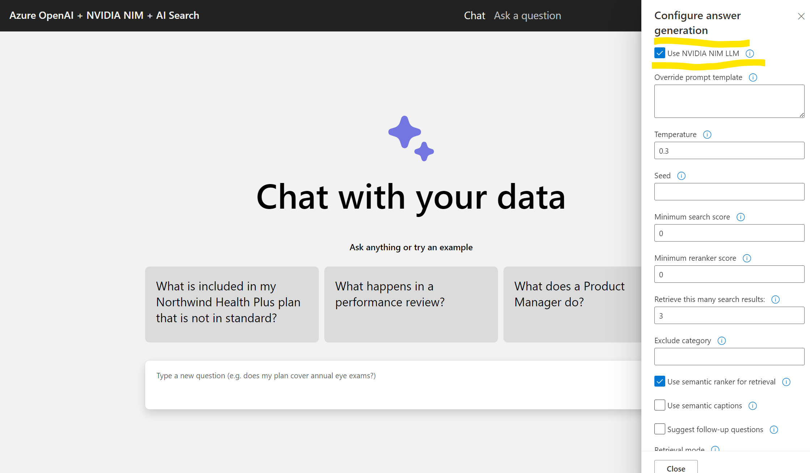

# Deploying with NVIDIA NIM

## Overview

Along with OpenAI Large Language Models (LLMs), NVIDIA NIM along with Meta Llama 3.1 8B can be used for ChatCompletion requests.This document outlines the steps to configure the app to use NVIDIA NIM.

## Prerequisites

Ensure you've set up the NVIDIA NIM API and have the necessary credentials, you'll need following values ready.

- `NVIDIA_NIM_API_ENDPOINT`: The endpoint of the NVIDIA NIM API, e.g https://llama3-8b-nim-endpoint-aml-1.westeurope.inference.ml.azure.com/v1. You must use /v1 in the end.
- `NVIDIA_NIM_API_KEY`: The API key for the NVIDIA NIM API.
- `NVIDIA_NIM_MODEL_NAME`: The name of the model to use, e.g `meta-llama/Meta-Llama-3.1-8B`.
- `NVIDIA_NIM_DEPLOYMENT_NAME`: The name of the Azure ML deployment to use, e.g `llama3-8b-nim-endpoint-aml-1`.

## Set Environment Variables

You can set the environment variables  using the azd env set command or through app service configurations in the Azure Portal..

Please see the sample command below.

- azd env set NVIDIA_NIM_ENABLED true

- azd env set NVIDIA_NIM_ENDPOINT https://yourendpoint.inference.ml.azure.com/v1

- azd env set NVIDIA_NIM_API_KEY yourapitoken

- azd env set NVIDIA_NIM_MODEL_NAME "meta/llama-3.1-8b-instruct"

- azd env set NVIDIA_NIM_DEPLOYMENT_NAME llama31-8b-instruct-aml-1 #your AzureML deployment name

## Using the NIM

In the chat/Ask interface, you'll see option to select "Use NVIDIA NIM" checkbox. Using this checkbox will make the app to use the NVIDIA NIM for the chat completion requests.

## Limitations
The app still relies on Azure OpenAI to compute embeddings for chat completion requests. However, you can remove the chat models (GPT-3.5 or GPT-4) from the Azure OpenAI service if you choose not to use them. Just ensure that the embedding model (text-embedding-ada$) remains in place and is not deleted.

If you do not have any Azure OpenAI service or embedding model, you may use "Text" as Retrieval model. 

